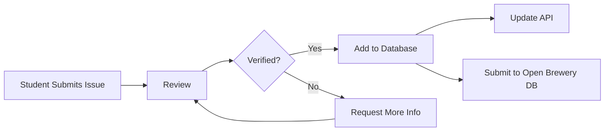

# Contributing to BADM 554 Brewery Database

Thank you for helping improve our brewery database! This guide will help you submit additions, updates, or corrections.

## How to Contribute

### Option 1: Submit a GitHub Issue (Recommended for Students)

1. **Go to the Issues tab** in this repository
2. **Click "New Issue"**
3. **Choose the appropriate template:**
   - **Add New Brewery** - Submit a brewery that's missing from the database
   - **Update Brewery Information** - Report incorrect or outdated information
   - **Report Closed Brewery** - Report a permanently closed brewery

4. **Fill out all required fields**
5. **Submit the issue**

Your submission will be reviewed and, if approved, added to the database!

### Option 2: Submit a Pull Request (Advanced)

If you're comfortable with Git and JSON:

1. Fork this repository
2. Edit `breweries.json`
3. Submit a pull request with your changes

## Contribution Guidelines

### Adding a New Brewery

**Required Information:**
- Brewery name
- Brewery type (micro, nano, regional, brewpub, large, etc.)
- Complete address (street, city, state, postal code, country)
- Phone number (if available)
- Website (if available)

**Optional but Helpful:**
- GPS coordinates (latitude/longitude)
- Photos or additional details

### Updating Brewery Information

**What You Can Update:**
- Contact information (phone, website)
- Address changes
- Brewery type changes
- Closure status
- GPS coordinates

**What You Need:**
- Brewery name or ID
- Field to update
- New/correct information
- Source of verification

### Verification Standards

Please verify information through:
- ✅ Official brewery website
- ✅ Phone call to brewery
- ✅ Personal visit
- ✅ Google Maps/Business listings
- ✅ Recent news articles
- ✅ Social media (official accounts only)

Avoid:
- ❌ Outdated information
- ❌ Unverified third-party sites
- ❌ Assumptions or guesses

## Submission Process



1. **Student submits** brewery information via GitHub issue
2. **Instructor/TA reviews** submission for completeness and accuracy
3. **Verification** - Information is checked against sources
4. **Approval** - Issue is labeled "approved"
5. **Database update** - Entry is added to `breweries.json`
6. **API deployment** - Updated data is deployed to production API
7. **Upstream submission** - Approved entries are submitted to official Open Brewery DB

## Brewery Types Explained

| Type | Description | Examples |
|------|-------------|----------|
| `micro` | Small brewery (< 15,000 barrels/year) | Most craft breweries |
| `nano` | Very small brewery (≤ 3 barrels per batch) | Homebrew-scale operations |
| `regional` | Regional brewery (15,000-6M barrels/year) | Sierra Nevada, New Belgium |
| `brewpub` | Brewery with attached restaurant/pub | Gordon Biersch, Rock Bottom |
| `large` | Large commercial brewery (> 6M barrels/year) | Anheuser-Busch, Miller Coors |
| `planning` | In planning stages, not yet open | - |
| `contract` | Contracts another brewery to produce beer | Narragansett |
| `proprietor` | Operates under another brewery's license | - |
| `closed` | Permanently closed | - |
| `bar` | Bar selling others' beers (not brewing) | - |

## JSON Format (for Pull Requests)

If submitting a pull request, use this format:

```json
{
  "id": "generate-uuid-v4",
  "name": "Example Brewery",
  "brewery_type": "micro",
  "address_1": "123 Main St",
  "address_2": null,
  "address_3": null,
  "city": "Champaign",
  "state_province": "Illinois",
  "postal_code": "61820",
  "country": "United States",
  "phone": "2175551234",
  "website_url": "https://www.examplebrewery.com",
  "longitude": -88.2434,
  "latitude": 40.1164
}
```

**Generate UUID:** https://www.uuidgenerator.net/version4

## Credit System (Optional)

Students who submit **verified** brewery additions or updates will:
- Be acknowledged in the repository
- Contribute to real-world open-source data
- Help improve the Open Brewery DB project

## Questions?

- Check existing issues before submitting duplicates
- Use the Discussion tab for general questions
- Contact your instructor for course-related questions

## Upstream Contribution

Once your submissions are approved and verified, they will be:
1. Added to our BADM 554 API immediately
2. Batched with other student submissions
3. Submitted to the official [Open Brewery DB](https://github.com/openbrewerydb/openbrewerydb) repository

This means your contributions will help the entire craft beer community worldwide! 🍺

---

**Thank you for contributing to open data!**
